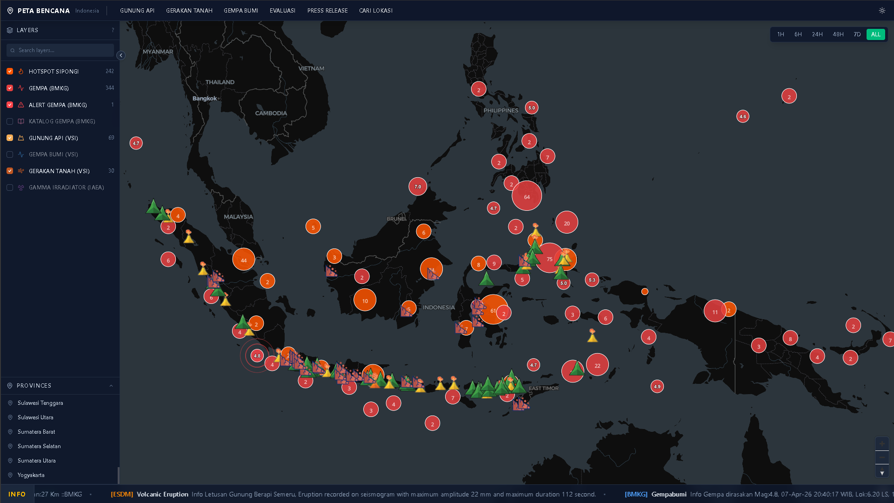
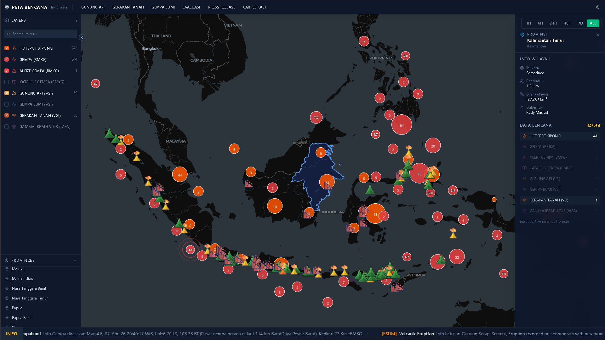
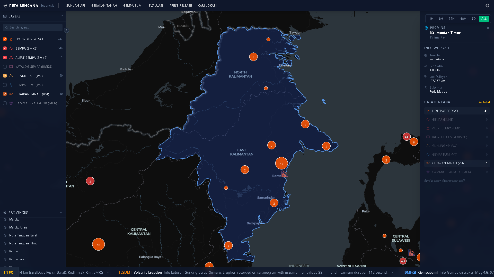

# Peta Bencana Mandala

**Interactive hazard map for Indonesia** — visualise earthquakes, volcanoes, landslides, hotspots, and radiation facilities on a single real-time map.

---

## Features

### Data Layers

Eight toggleable hazard layers, each with interactive map popups:

| Layer                        | Source       | Marker                        | Clustering |
| ---------------------------- | ------------ | ----------------------------- | ---------- |
| Hotspot SIPONGI              | Sipongi/KLHK | Orange circle                 | Yes        |
| Gempa Bumi — BMKG Global     | BMKG         | Red circle, magnitude-scaled  | Yes        |
| Alert Gempa — BMKG Real-time | BMKG         | Red circle + alert rings      | No         |
| Katalog Gempa — BMKG         | BMKG         | Pink circle, magnitude-scaled | Yes        |
| Gunung Api — VSI/ESDM        | VSI          | Animated GIF marker           | No         |
| Gempa Bumi — VSI/ESDM        | VSI          | Blue circle, magnitude-scaled | Yes        |
| Gerakan Tanah — VSI/ESDM     | VSI          | Animated GIF marker           | No         |
| Gamma Irradiator — IAEA      | IAEA         | Purple circle                 | Yes        |

### Map Capabilities

- **Dark / light theme** — Carto Dark Matter and Carto Voyager base tiles, toggled from the toolbar, persisted across sessions
- **Time filtering** — filter all dated layers to the last 1 h, 6 h, 24 h, 48 h, 7 days, or show all data
- **Magnitude-scaled circles** — earthquake markers grow with magnitude (scale 1–8 → radius 8–22 px)
- **Volcano alert status** — GIF markers coloured by VSI alert level (Green / Yellow / Orange / Red)
- **Concentric alert rings** — BMKG real-time earthquake alerts rendered with pulsing ring overlays
- **Marker clustering** — high-density layers group into cluster bubbles that expand on click
- **Province info panel** — click any province boundary to see name, capital, population, area, governor, island group, and a per-layer event count for that province
- **Running-text ticker** — animated news bar at the bottom of the screen fed from `running_text.json`
- **Custom data entry** — report a custom hazard point via form (category, title, description, coordinates, date); data saved locally in IndexedDB (no account required)
- **Map click-to-pick** — tap the map to populate coordinates in the custom data form

### No API Keys Required

All map tiles are served by Carto's free tier. Data files are served from `public/data/` or fetched from public government endpoints.

---

## Screenshots

### Main View — Dark Mode

### Province Info Panel

### Layer Selection & Popups

---

## Tech Stack

| Technology     | Version | Role                        |
| -------------- | ------- | --------------------------- |
| React          | 19      | UI framework                |
| TypeScript     | 6       | Type safety                 |
| Vite           | 8       | Build tool / dev server     |
| MapLibre GL JS | 5       | Interactive map engine      |
| Tailwind CSS   | v4      | Utility-first styling       |
| Radix UI       | —       | Accessible UI primitives    |
| Dexie.js       | 4       | IndexedDB wrapper           |
| Lucide React   | —       | Icon library                |
| Turf.js        | —       | Geospatial point-in-polygon |

---

## Data Sources

| Layer                                       | Provider       | Notes                                                            |
| ------------------------------------------- | -------------- | ---------------------------------------------------------------- |
| Hotspot SIPONGI                             | Sipongi / KLHK | Satellite fire hotspot detections                                |
| Gempa Bumi, Alert Gempa, Katalog Gempa      | BMKG           | Seismic data — real-time and historical                          |
| Gunung Api, Gempa Bumi (VSI), Gerakan Tanah | VSI / ESDM     | Volcano, seismic, and landslide data from the Ministry of Energy |
| Gamma Irradiator                            | IAEA           | Licensed gamma irradiation facility locations                    |

---

## Documentation

| Guide                              | Purpose                                                          |
| ---------------------------------- | ---------------------------------------------------------------- |
| [QUICKSTART.md](QUICKSTART.md)     | Get the app running locally in under 5 minutes                   |
| [DEVELOPMENT.md](DEVELOPMENT.md)   | Architecture, data layer reference, state management, test suite |
| [CONTRIBUTING.md](CONTRIBUTING.md) | How to report bugs and submit pull requests                      |
| [CHANGELOG.md](CHANGELOG.md)       | Version history                                                  |

---

## License

Copyright 2026 Peta Bencana Mandala contributors.

Licensed under the [Apache License, Version 2.0](LICENSE).
